# *Primeros pasos con docker*

## **Ejercicios**

### **1. Instala docker en una máquina y configúralo para que se pueda usar con un usuario sin privilegios.**
---

Para darle permisos al usuario sin necesidad de que tenga que usar el comando sudo hay que hacer lo siguiente

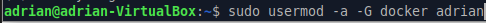

al usar esto el usuario tendrá permisos de usar el comando docker sin necesidad de ser superusuario

### **2. Ejecuta un contenedor a partir de la imagen hello-word. Comprueba que nos devuelve la salida adecuada. Comprueba que no se está ejecutando. Lista los contenedores que están parado. Borra el contenedor.**
---

Primero habrá que usar el comando **docker run** y el nombre de la imagen para crearlo y ejecutarlo al momento

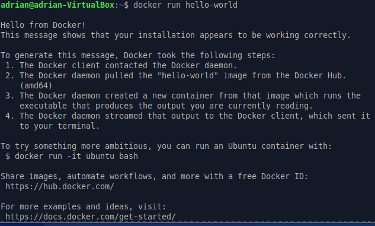

Para saber si el contenedor despues de crearlo no se esta ejecutando puedes comprobar con **docker ps -a**

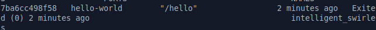

Como se puede comprobar pone que ha salido del contenedor y ya no está ejecutandose.

El siguiente paso es borrar el contenedor con **docker rm** y el nombre del contenedor que le asigna docker

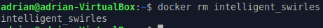

con esto ya el contenedor se borraria.

### **3. Crea un contenedor interactivo desde una imagen debian. Instala un paquete (por ejemplo nano). Sal de la terminal, ¿sigue el contenedor corriendo? ¿Por qué?. Vuelve a iniciar el contenedor y accede de nuevo a él de forma interactiva. ¿Sigue instalado el nano?. Sal del contenedor, y bórralo. Crea un nuevo contenedor interactivo desde la misma imagen. ¿Tiene el nano instalado?**
---

Primero habrá que crear el contenedor con debian y entrar en modo interactivo para que nos deje dentro del contenedor.

Una vez dentro hay que instalar el paquete nano

*La captura contiene las dos cosas*

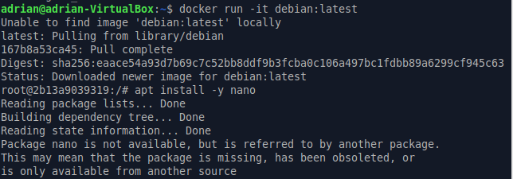

Al hacer **exit** sales del contenedor y comprobamos que ya no esta ejecutandose

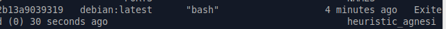

Si inicio el contenedor con **docker start** y luego un **docker exec** nos volverá a meter al contenedor y podremos comprobar que nano sigue estando instalado

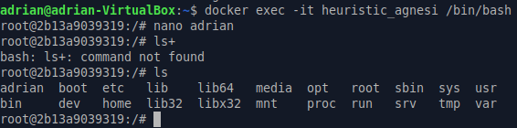

Una vez comprobado salimos del contenedor lo borramos y cuando creamos otro contenedor con la misma imagen ya no estará instalado el paquete nano porque es un nuevo contenedor.

### **4. Crea un contenedor demonio con un servidor nginx, usando la imagen oficial de nginx. Al crear el contenedor, ¿has tenido que indicar algún comando para que lo ejecute? Accede al navegador web y comprueba que el servidor esta funcionando. Muestra los logs del contenedor.**
---

Para crear el contenedor con el servidor nginx habrá que especificarle varias cosas, no como los anteriores contenedores, en este contenedor habrá que indicarle el puerto por el que se expone y conecta.

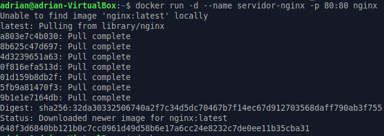

Una vez creado vamos al navegador y ponemos **http://localhost** y nos enviará a la pagina de inicio donde te da la bienvenida a nginx

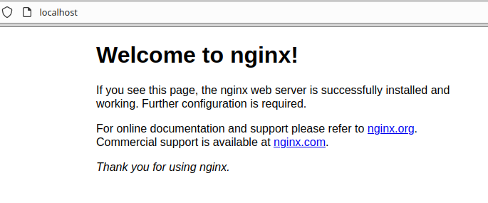

Despues de esto mostramos los logs del contenedor

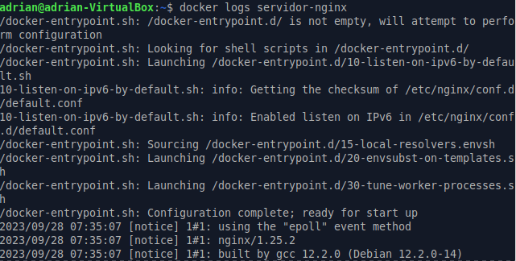

### **5. Crea un contenedor con la aplicación Nextcloud, mirando la documentación en docker Hub, para personalizar el nombre de la base de datos sqlite que va a utilizar.**
---

Lo primero es traer la imagen de nextcloud con **docker pull nextcloud**, al traer la imagen ya solo tenemos que arrancar el contenedor pero con unos comandos especiales para luego poder entrar a nextcloud.

los comandos son los siguientes:

-e NEXTCLOUD_ADMIN_USER: el nombre de usuario administrador

-e NEXTCLOUD_ADMIN_PASSWORD: la contraseña del usuario

-e SQLITE_DATABASE: esto dará nombre a nuestra base de datos, despues de poner el nombre hay que pone **.sqlite**

y el comando quedaria asi:

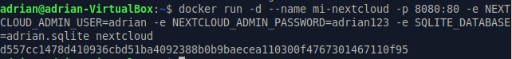

Una vez ya lo haya hecho te vas al navegador web y pones **http://localhost:8080**, con esto entraras a nextcloud y tendras que iniciar sesion con el usuario y contraseña creados en el momento de creacion del contenedor.

Al entrar aparecera esto:

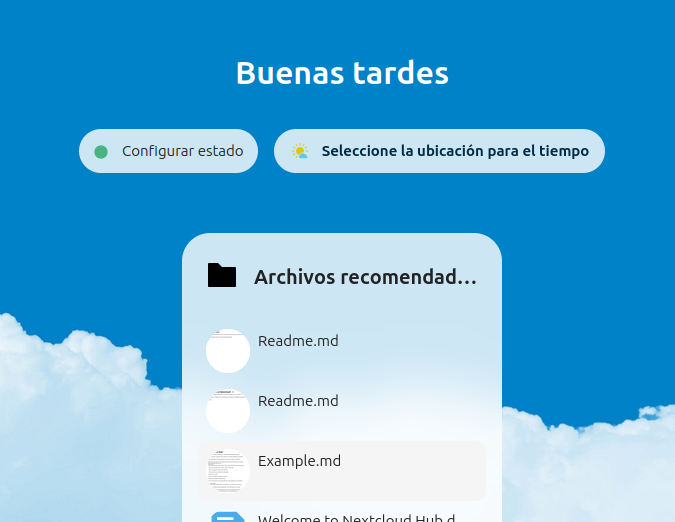

Con esto ya estaria el contenedor con nextcloud